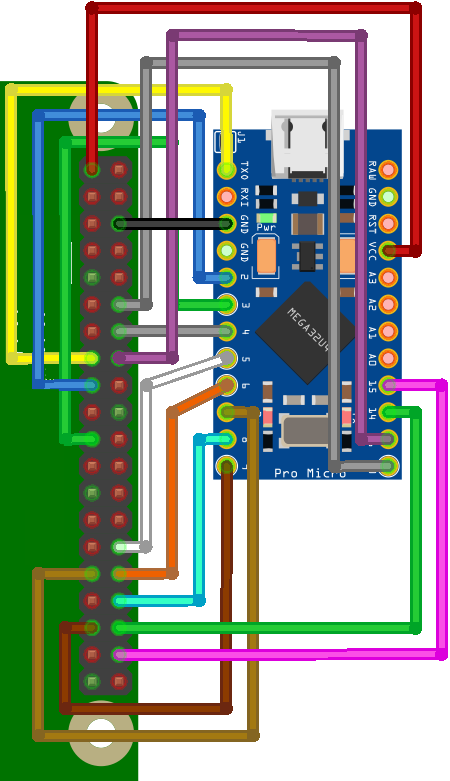
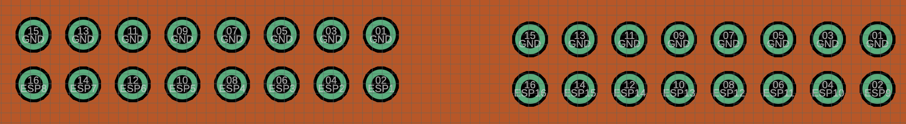

# STG5 and BRAINSBoard GUI
### This will be a quick guide on how to use all the different tools developed for the BRAINSBoard, STG5 and more!

These are both useful tools used in conjunction with one another to easily allow for multi-channel stimulation of the NeuroNexus A1x16 16-Channel Electrode.

# BRAINSBoard:
## Purpose

The BRAINSBoard is a proprietary custom PCB that is designed to electronically switch between Cathode, Anode, Ground, and Floating states for 16 different electrode channels without physically interacting with the components during experiments. This enables:
- Stimulation at different loci in patterns.
- Grounding of every inactive pin to prevent noise.
- Use with a GUI designed for efficient pin switching during and between experiments.

## Components of the Board

### Connectors
- <code style="color : gold">Raspberry Pi/Arduino:</code> 2x20 Female Header facilitates connections to control and process data from Arduino/Raspberry Pi. 2x20 90º Male Header allows external connections to unused/useful pins
  - Raspberry Pi can be directly connected on top of the 2x20 Female Header. Connection Pinout as follows:
  - 
  - An Arduino can be connected to those same pins with the following Pinout (demonstrated with Arduino Pro Mini):

  - Other tools (ie. sensors, actuators, external triggers) can be accessed from the 2x20 90º Male Header with the following Pinout: 
- $\text{\color{white}NeuroNexus}$ Standard 2x8 Box Connectors with grounding on all top pins to minimize noise. Pinout:
- $\text{\color{red}Banana Connectors:}$ Connects to cathode and anode pulses from an Isolated Analog Power Stimulator (preferred STG5) and a Signal Ground that can be connected to the same common ground as the electrode and stimulator.

### Electronic Parts
1. **40-Pin Female Header:** Allows flexibility and attachment to various rigs.
2. **16 Pin Straight Box Header:** Direct connection to Raspberry Pi, facilitating easy connections to an Arduino.
3. **Octal Transparent D-Type Latch with 3-State Output:** Controls the logic of cathode, anode, and inactive pins with minimal physical pins.
4. **Analog SP3T Switch:** Allows selection between cathode, anode, or ground without risking electronic interference.
5. **Solid State Relays:** Provides electrical isolation and protection, ensuring that no current leaks between the components.
6. **Resistors/Capacitors:** Used to manage the internal LED's power to prevent burning out.

## How It Works

### $\text{\color{#FF69B4}Octal Transparent D-Type Latch}$
- Requires a VCC +5V and ground.
- Output Enable and Latch Enable controls, connected to Arduino/Raspberry Pi, to manage pin outputs.

### $\text{\color{orange}Analog SP3T Switch}$
- Two inputs determine the current path (cathode, anode, ground).
- Output directed through a connector managing pin outputs.

### $\text{\color{cyan}Solid State Relay}$
- Activated by a control switch, it powers an LED internally, which in turn activates a photosensitive diode to close the circuit.
