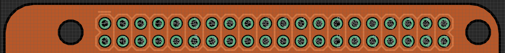
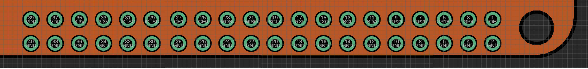
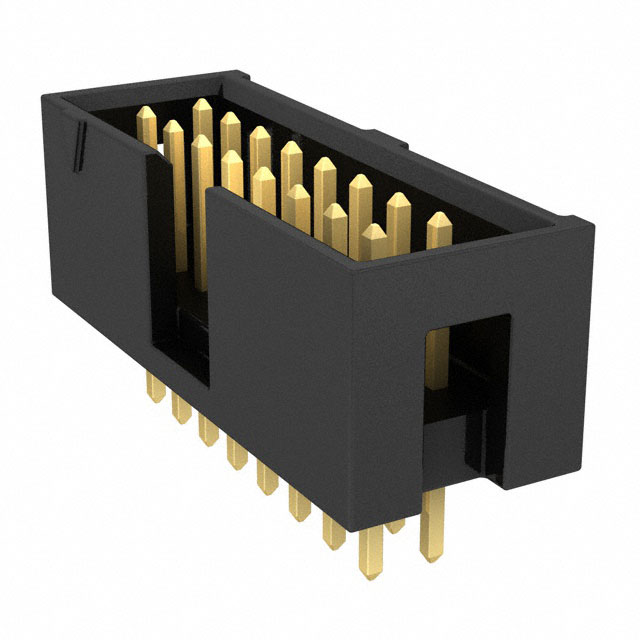

# STG5 and BRAINSBoard GUI
### This will be a quick guide on how to use all the different tools developed for the BRAINSBoard, STG5 and more!

These are both useful tools used in conjunction with one another to easily allow for multi-channel stimulation of the NeuroNexus A1x16 16-Channel Electrode.

# BRAINSBoard:
## Purpose

The BRAINSBoard is a proprietary custom PCB that is designed to electronically switch between Cathode, Anode, Ground, and Floating states for 16 different electrode channels without physically interacting with the components during experiments. This enables:
- Stimulation at different loci in patterns.
- Grounding of every inactive pin to prevent noise.
- Use with a GUI designed for efficient pin switching during and between experiments.

## Components of the Board

### Connectors
- $\textbf{\color{yellow}Raspberry Pi/Arduino 2x20 Female Header}$ facilitates connections to control and process data from Arduino/Raspberry Pi. $\textbf{\color{yellow}2x20 90º Male Header}$ allows external connections to unused/useful pins
  - Raspberry Pi can be directly connected on top of the $\textbf{\color{yellow}2x20 Female Header}$. Connection Pinout as follows:

  - An Arduino can be connected to those same pins with the following Pinout (demonstrated with Arduino Pro Mini):
 

  - Other tools (ie. sensors, actuators, external triggers) can be accessed from the $\textbf{\color{yellow}2x20 90º Male Header}$ with the following Pinout:

- $\textbf{\color{white}NeuroNexus}$ Standard 2x8 Box Connectors with grounding on all top pins to minimize noise. Pinout:

- $\textbf{\color{red}Banana Connectors:}$ Connects to cathode and anode pulses from an Isolated Analog Power Stimulator (preferred STG5) and a Signal Ground that can be connected to the same common ground as the electrode and stimulator.

### Products Used:

$\textbf{\color{yellow}External Connectors:}$

[2x20 Female Header](https://www.digikey.com/en/products/detail/te-connectivity-amp-connectors/2-215307-0/1149668)

[2x20 90º Male Header](https://www.digikey.com/en/products/detail/oupiin/2011-2X20G00RB/13251482)

$\textbf{\color{white}Connectors to Neuronexus:}$

**Samtec Box Header** from [Digikey](https://www.digikey.com/en/products/detail/samtec-inc/TSS-108-01-G-D/2345166):

$\textbf{\color{red}Connectors to Analog Stimulus Isolator:}$

[Ground Connector](https://www.digikey.com/en/products/detail/cliff-electronic-components-ltd/FCR7350G/17729033)

[Cathode Stimulus Connector](https://www.digikey.com/en/products/detail/pomona-electronics/73099-2/10483465)

[Anode Stimulus Connector](https://www.digikey.com/en/products/detail/pomona-electronics/73099-0/10483460)

## Electronics for Selecting Channels:

The following are used to be able to utilize Arduino Logic and rapidly change the connection between our stimulus signal from the isolated stimulator and the respective electrode channels.

### $\textbf{\color{#FF69B4}Octal Transparent D-Type Latch}$
- Requires a VCC +5V and ground.
- Output Enable and Latch Enable controls, connected to Arduino/Raspberry Pi, to manage pin outputs.
- Utilizes multiplexing capabilities to reduce connections needed to the microcontronoller and allows for future scalability.
- Latch capabilities ensure channel selection stability until change is required.
- [Texas Instruments Octal Transparent D-Type Latch](https://www.digikey.com/en/products/detail/texas-instruments/CY74FCT373TSOC/1508737)

### $\textbf{\color{orange}Analog SP3T Switch}$
- Two inputs determine the current path (cathode, anode, ground, or floating).
- Output directed through a connector managing pin outputs.
- Useful digital switch to ensure one of the four output states is set at all times.
- [Texas Instruments Analog SP3T Switch](https://www.digikey.com/en/products/detail/texas-instruments/TS5A3357DCUR/695801)

### $\textbf{\color{cyan}Solid State Relay}$
- Activated by a control switch, it powers an LED internally, which in turn activates a photosensitive diode to close the circuit.
- Optical Isolation prevents electrical interference from the microcontroller side of the circuit to the Analog Isolator stimulus sent to the respective channels.
- These specific Solid State Relays will be useful in handling high variance in Volatge due to unpredictable resistance in the brain as current stimulus is sent.
- [IXYS 600V 100mA Dual Single Pole Normally Open Relay](https://www.digikey.com/en/products/detail/ixys-integrated-circuits-division/PAA193STR/3077694)

### $\textbf{\color{green}LEDS}$
- Top LED is a $\text{\color{red}RED LED}$ that is utilized to indicate whether or not the BRAINS Board is receiving power.
- Bottom LED is a $\text{\color{green}GREEN LED}$ that is utilized to indicate whether the Output Enable is activated, determining whether or not outputs are being sent to change channels

# GUI

There are various sets of code designed to interface with the BRAINS Board through either the Arduino or Raspberry Pi.
These are guides on how they are designed as well as a simple measure as to how they may be manipulated for various uses.

## Part 1: Using Serial Communication with Arduino to Map Channels:

The current BRAINS Board API is built around Serial Inputs that are translated into pin activation using the [Brainsboard Serial Program Arduino Code](brainsboard_serial_pgm.ino)

This is also all right now designed to be used alongside an Arduino Micro Pro with the pinout drawn above, though it can easily be changed to work with any Arduino board and pinout using the #define functions.

The following pins correspond to channels above:
| Electrode Channel |    Arduino Pins     |
|:-----------------:|:-------------------:|
| Channel **1**     | Pin 16 + 1 + 5 + 6  |
| Channel **2**     | Pin 16 + 1 + 7 + 8  |
| Channel **3**     | Pin 16 + 1 + 9 + 10 |
| Channel **4**     | Pin 16 + 1 + 14 + 15|
| Channel **5**     | Pin 16 + 2 + 5 + 6  |
| Channel **6**     | Pin 16 + 2 + 7 + 8  |
| Channel **7**     | Pin 16 + 2 + 9 + 10 |
| Channel **8**     | Pin 16 + 2 + 14 + 15|
| Channel **9**     | Pin 16 + 3 + 5 + 6  |
| Channel **10**    | Pin 16 + 3 + 7 + 8  |
| Channel **11**    | Pin 16 + 3 + 9 + 10 |
| Channel **12**    | Pin 16 + 3 + 14 + 15|
| Channel **13**    | Pin 16 + 4 + 5 + 6  |
| Channel **14**    | Pin 16 + 4 + 7 + 8  |
| Channel **15**    | Pin 16 + 4 + 9 + 10 |
| Channel **16**    | Pin 16 + 4 + 14 + 15|

**The logic is this way because of the following:**

- Our **Output Enable** pin, that is connected to all 4 of the Octal Latches, is connected to **Arduino Pin 16**
- We have 4 **Latch Enable** pins that are used to determine which latch we are controlling
  - **Pin 1** is connected to the first **OCTAL LATCH**, which controls signals sent to the **SP3T** switches that set channel configuration for **Electrode Channels 1-4**
  - **Pin 2** is connected to the second **OCTAL LATCH**, which controls signals sent to the **SP3T** switches that set channel configuration for **Electrode Channels 5-8**
  - **Pin 3** is connected to the third **OCTAL LATCH**, which controls signals sent to the **SP3T** switches that set channel configuration for **Electrode Channels 9-12**
  - **Pin 4** is connected to the fourth **OCTAL LATCH**, which controls signals sent to the **SP3T** switches that set channel configuration for **Electrode Channels 13-16**
- We then have **8 Data Input** pins connected to all of the **Octal Latches**, which will change the state of the digital output of the latches to High or Low dependent on a) if the latch enable for said Octal Latch is on and b) if the Arduino pin connected to each digital input pin is high or low
  - **Pins 5 and 6** control the output to the **SP3T** controlling **Electrode Channels 1, 5, 9, and 13**.
  - **Pins 7 and 8** control the output to the **SP3T** controlling **Electrode Channels 2, 6, 10, and 14**.
  - **Pins 9 and 10** control the output to the **SP3T** controlling **Electrode Channels 3, 7, 11, and 15**.
  - **Pins 14 and 15** control the output to the **SP3T** controlling **Electrode Channels 4, 8, 12, and 16**.

**Important Note:** The **A0 pin** is used as an input of any External Triggers from any other device (ie. a stimulator) for the board to use as an input to switch channels, if required.

The code also has 4 states that any channel can be set to at any given moment: **FLOATING**, **CATHODE**, **ANODE**, and **SIGNAL GROUND**. The board is designed to allow the **OCTAL LATCH** to send 2 outputs to any given **SP3T** correlated to a specific electrode channel, and logic of the switch by the **SP3T** is treated as follows:
| INPUT 1 STATE | INPUT 2 STATE | CHANNEL CONNECTED |
|:-------------:|:-------------:|:-----------------:|
| **LOW**       | **LOW**       | **FLOATING**      |
| **HIGH**      | **LOW**       | **CATHODE**       |
| **LOW**       | **HIGH**      | **ANODE**         |
| **HIGH**      | **HIGH**      | **SIGNAL GROUND** |

**Important Note:** The **SIGNAL GROUND** is connecting any signal connected to the $\textbf{\color{green}Green Banana Connector}$, which should ideally connected to the same **Reference Ground** that you would use for any electrophysiology or stimulation experiment.

### Serial Communication Logic:
**The following is a step-by-step guide for utilizing any serial communication to control the channel outputs at any given time**
1. Ensure you are using 115200 bps as the data rate for for Serial line
2. '[' Begins reading channel Data
3. **'{X1}'** is a *Hexadecimal Number*
    - **To Set Channels 1-10:** X1 corresponds to a numerical value Channel # - 1 (ie. Channel 1 is 0, Channel 2 is 1, ..., Channel 10 is 9)
    - **To Set Channels 11-16:** X1 corresponds to an alphabtical value between A-F (ie. Channel 11 is A, Channel 12 is B, ..., Channel 16 is F)
4. **'{X2}'** is a *Character*
      - **F** for **FLOATING**
      - **C** for **CATHODE**
      - **A** for **ANODE**
      - **G** for **SIGNAL GROUND**
5. **']'** Closes *Reading Channel States* and *"Applies"* the channel states by utilizing logic to change where channels are connected
6. **'x'** Sets a *wait* until the **External Trigger Pin** recieves a signal (and won't continue until that trigger is low to change anything)
7. **'{t}{u}'** Sets a *wait* for a set time
      - **'{t}'** is a *numerical value* that is read and stored until the serial code reads a non-numerical value
      - **'{u}'** is a *character* that is written after the numerical values have been written that determines the units of delay time
        - **s** will set the *time {t}* to seconds
        - **m** will set the *time {t}* to milliseconds
        - **u** will set the *time {t}* to microseconds
8. **'l{c}'** Sets up a *loop* for the inputted channel setups for *{c}* more counts
      - If *{c}* is not set, it will infinitely loop.
9. **Important Note:** It is not necessary to write out every channel, previous channel states are already stored and latched until that specific channel is changed
#### Example Serial Command:
**[0F1F2F3F4F5F6F7F8F9FAFBFCFDFEFFF]200u[0C1A]x[0G1GEAFC]2sl3**
- This will first **set every channel** to **FLOATING**
- It will then **wait 200 microseconds**
- It will then change **Channel 1** to **CATHODE** and **Channel 2** to **ANODE**
- It will then **wait** until it recieves the **External Trigger** at **Pin A0**
- It will then change **Channel 1** and **Channel 2** to **SIGNAL GROUND** and **Channel 15** to **ANODE** and **Channel 16** to **CATHODE**
- It will then **wait 2 seconds**
- It then reads **l3**, so it will **loop** the previous steps **3 more times**

## Part 2: Using the Raspberry Pi to Map Channels Directly

### $\textbf{\color{white}This work was supported by NIH NINDS project number 1R01NS120850}$

